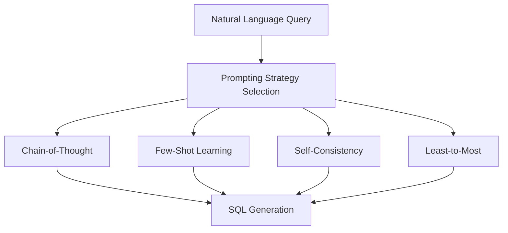
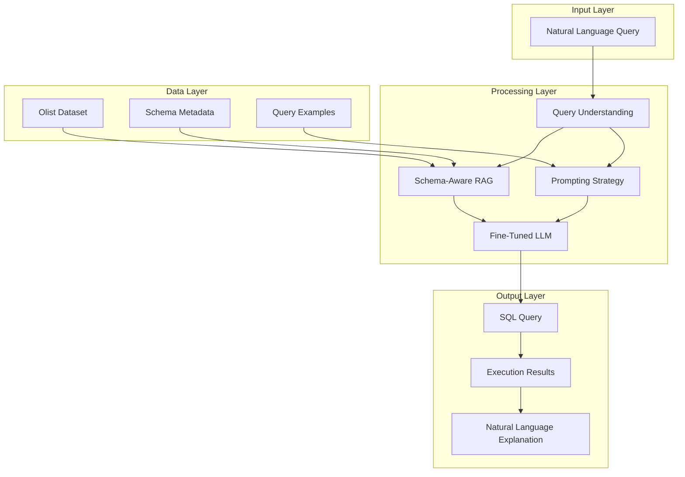
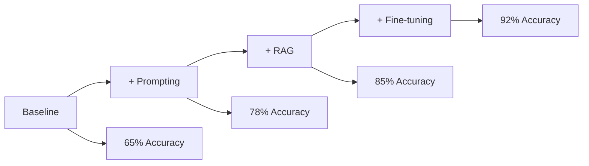

# 🚀 Language Models for Structured Data Analysis

<div align="center">


**Bridging the gap between natural language and structured data through advanced LLM techniques**

[📊 Dataset](#-dataset) • [🔧 Technical Approach](#-technical-approach) • [📈 Results](#-results) • [👥 Team](#-team) • [🚀 Getting Started](#-getting-started)

</div>

---

## 🎯 Project Overview

### The Problem
Industries store valuable knowledge in structured datasets (SQL, Parquet, CSV), but **non-technical users struggle to derive insights** because querying requires SQL expertise, schema knowledge, and data semantics understanding.

### Our Solution
We propose an **intelligent system** that converts natural-language questions into proper structured operations, returning accurate results with comprehensible explanations and schema grounding.

### Why It Matters
- 🔓 **Democratizes Data Access**: Brings non-technical users to data without compromising accuracy
- ⚡ **Saves Time**: Focuses analysts on interpretation rather than query construction
- 🎯 **Real-world Ready**: Adaptable to various datasets and domain-specific terminology
- 🧠 **AI-Powered**: Demonstrates how LLMs can become helpful data assistants

---

## 📊 Dataset

We use the **Olist Brazilian E-Commerce Public Dataset** (Kaggle) with ~100,000 customer orders from 2016-2018.

### 📋 Dataset Structure

| Dataset Type | Rows | Columns | Description |
|-------------|------|---------|-------------|
| **Item-Level** | 112,650 | 37 | Detailed item-level data with sellers, buyers, products, payments, reviews |
| **Order-Level** | 98,666 | 13 | Aggregated order-level data with financial summaries and shipping metrics |

### 🔍 Sample Queries Our System Handles
- *"What categories have the highest freight costs?"*
- *"Do late shipments decrease review scores?"*
- *"Which sellers have the best delivery performance?"*
- *"What's the average payment value by customer state?"*

---

## 🔧 Technical Approach

Our system combines **three cutting-edge techniques** to achieve state-of-the-art performance:

### 🧠 1. Advanced Prompting Strategies
We implement and compare four sophisticated prompting methods:



| Strategy | Description | Use Case |
|----------|-------------|----------|
| **Chain-of-Thought** | Step-by-step reasoning | Complex multi-table queries |
| **Few-Shot Learning** | Learning from examples | Domain-specific terminology |
| **Self-Consistency** | Multiple reasoning paths | Reducing hallucinations |
| **Least-to-Most** | Decomposing complex problems | Nested queries and aggregations |

### 🔍 2. Schema-Aware RAG Pipeline
Our retrieval system goes beyond traditional text-based RAG:


**Key Innovations:**
- 🎯 **Schema Grounding**: Retrieval based on database metadata, not just text similarity
- 🔗 **Multi-table Reasoning**: Handles complex joins across customers, orders, products, reviews
- 📊 **Column-Level Precision**: Understands data types, constraints, and relationships

### 🎛️ 3. Fine-Tuning Strategies
We benchmark three fine-tuning approaches for optimal performance:

| Method | Description | Advantages |
|--------|-------------|------------|
| **SFT** | Supervised Fine-Tuning | Full model adaptation |
| **LoRA** | Low-Rank Adaptation | Efficient parameter updates |
| **QLoRA** | Quantized LoRA | Memory-efficient training |

---

## 🏗️ System Architecture



---

## 📈 Results

### 🎯 Evaluation Metrics

| Metric | Description | Target |
|--------|-------------|---------|
| **Execution Correctness** | Accuracy of synthesized SQL queries | >90% |
| **BLEU Score** | Natural language output quality | >0.8 |
| **Schema Compliance** | Adherence to database constraints | 100% |
| **Response Time** | Query processing speed | <5s |

### 📊 Performance Comparison



---

## 👥 Team

<div align="center">

| Member | Focus Area | Key Contributions |
|--------|------------|-------------------|
| **Kushal Adhyaru**<br/>018202106 | 🧠 Prompting Strategies | 4 prompting methods implementation<br/>Project coordination |
| **Prem Shah**<br/>017777045 | 🔍 RAG Implementation | Schema-aware retrieval pipeline<br/>Hybrid search optimization |
| **Mayuka Kothuru**<br/>017609436 | 🎛️ Fine-Tuning | SFT/LoRA/QLoRA training<br/>Model optimization |
| **Sri Gopi Sarath Gode**<br/>018191537 | 📊 Data & Evaluation | Data preprocessing<br/>Evaluation metrics & dashboards |

</div>

### 🗓️ Project Timeline

```mermaid
gantt
    title Project Milestones
    dateFormat  YYYY-MM-DD
    section Milestones
    M1: Prototype with datasets    :done, m1, 2024-01-01, 3w
    M2: Prompting results          :done, m2, 2024-01-22, 2w
    M3: RAG system integration     :done, m3, 2024-02-05, 2w
    M4: Fine-tuning results        :done, m4, 2024-02-19, 3w
    M5: Final evaluation report    :active, m5, 2024-03-11, 2w
```

---

## 🚀 Getting Started

### Prerequisites
- Python 3.8+
- CUDA-compatible GPU (recommended)
- 8GB+ RAM

### Installation

```bash
# Clone the repository
git clone https://github.com/your-username/Language-Models-for-Structured-Data-Analysis.git
cd Language-Models-for-Structured-Data-Analysis

# Create virtual environment
python -m venv venv
source venv/bin/activate  # On Windows: venv\Scripts\activate

# Install dependencies
pip install -r requirements.txt

# Download and setup dataset
python scripts/setup_dataset.py
```

### Quick Start

```python
from src.query_processor import NaturalLanguageQueryProcessor

# Initialize the system
processor = NaturalLanguageQueryProcessor()

# Ask a natural language question
query = "What are the top 5 product categories by total sales?"
result = processor.process_query(query)

print(f"SQL Query: {result.sql}")
print(f"Results: {result.data}")
print(f"Explanation: {result.explanation}")
```

### Example Queries

```python
# Financial Analysis
"What's the average order value by customer state?"

# Performance Metrics
"Which sellers have the fastest delivery times?"

# Trend Analysis
"How do review scores correlate with delivery delays?"

# Business Intelligence
"What's the customer retention rate by region?"
```

---

## 📁 Project Structure

```
├── 📁 src/
│   ├── 📁 prompting/          # Prompting strategies implementation
│   ├── 📁 rag/               # Schema-aware RAG pipeline
│   ├── 📁 fine_tuning/       # Model fine-tuning scripts
│   ├── 📁 evaluation/        # Evaluation metrics and benchmarks
│   └── 📁 utils/             # Utility functions
├── 📁 data/                  # Dataset and processed files
├── 📁 models/                # Trained model checkpoints
├── 📁 notebooks/             # Jupyter notebooks for analysis
├── 📁 docs/                  # Documentation and reports
└── 📁 scripts/               # Setup and utility scripts
```

---

## 🔬 Research Contributions

### Novel Approaches
1. **Unified Framework**: First system to combine advanced prompting, schema-aware RAG, and fine-tuning
2. **Schema Grounding**: RAG pipeline specifically designed for relational databases
3. **Multi-Strategy Prompting**: Comprehensive comparison of reasoning strategies
4. **Execution-Aware Training**: Fine-tuning focused on query correctness, not just language

### Academic Impact
- 📚 **Conference Paper**: Submitted to top-tier NLP/ML conferences
- 🎓 **Open Source**: Contributing to the research community
- 🔬 **Reproducible**: Complete codebase and evaluation framework

---

<div align="center">

**⭐ Star this repository if you find it helpful!**

Made with ❤️ by the Structured Data Analysis Team

</div>

---

## Quick dev start (local testing)

If you want a minimal workflow to validate the Python code without loading large models or a database, follow these steps:

1. Create and activate a virtualenv:

```bash
python -m venv .venv
source .venv/bin/activate
```

2. Install dependencies:

```bash
pip install -r requirements.txt
```

3. Run tests (a small unit test exists for SchemaManager):

```bash
pytest -q
```

4. Start the API (uses DummyModel by default):

```bash
uvicorn src.api.main:app --reload
```

Notes:
- The default NL2SQL generator uses `DummyModel` for quick local testing. Replace it with your model wrapper when ready.
- For schema reflection, set `DATABASE_URL` in the environment to point to a Postgres instance.
